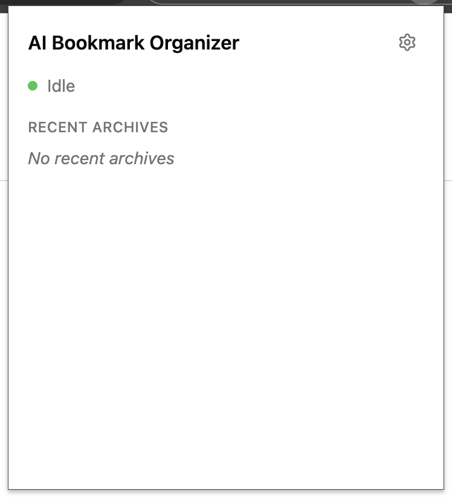
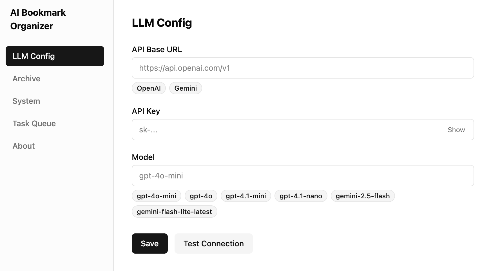
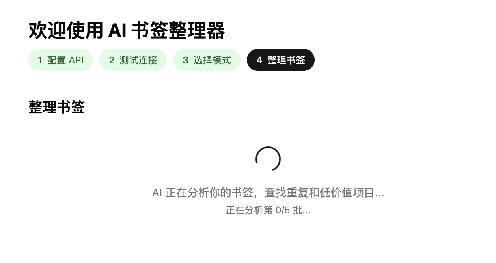

# AI Bookmark Organizer

> A Chrome extension that uses your own LLM API to automatically classify and organize bookmarks into a clean, semantic folder structure.


---

## What is it?

Most people's bookmark bar is a graveyard. AI Bookmark Organizer solves this by hooking into Chrome's bookmark system — every time you save a bookmark (`Ctrl+D`), it silently reads the page content, calls your LLM, and moves the bookmark into the right folder. No manual sorting, no third-party cloud, no subscription.

**Key differentiators:**

- **Bring your own API** — Works with OpenAI, DeepSeek, Ollama, or any OpenAI-compatible endpoint. You control the cost and privacy.
- **Reads page content** — Not just the URL and title. Extracts meta description and body text for smarter classification.
- **Semantic folder structure** — AI follows a flat, prefix-coded convention (`01_🔥_Critical`, `10_📚_Library`) designed for long-term maintainability.
- **Non-destructive** — Auto-backup on first run. Every archive action has a 15-second Undo button.

---

## How it works

```
You press Ctrl+D
  → Extension captures the new bookmark
  → Waits 5s (lets you rename/move in the native dialog)
  → Content Script extracts page title, description, and body text
  → Calls your LLM with the content + your current folder tree
  → LLM returns the best-fit folder path
  → Bookmark is moved there automatically
  → Chrome notification: "🔖 Archived to 10_📚_Library" [Undo]
```

For bulk organization, the onboarding wizard scans all your existing bookmarks, proposes a folder structure, lets you edit it, then executes in batch.

---

## Screenshots

| Popup | Options | Onboarding |
|-------|---------|------------|
|  |  |  |

---

## Installation

### From source (developer mode)

1. Clone the repo and install dependencies:

```bash
git clone https://github.com/your-username/ai-bookmark-organizer.git
cd ai-bookmark-organizer
pnpm install
```

2. Build the extension:

```bash
pnpm build
```

3. Load into Chrome:
   - Open `chrome://extensions`
   - Enable **Developer mode** (top right toggle)
   - Click **Load unpacked** → select the `dist/` folder

---

## Setup

On first install, the onboarding wizard opens automatically:

1. **Configure your API** — Enter your LLM base URL, API key, and model name
   - OpenAI: `https://api.openai.com/v1` + your key + `gpt-4o-mini`
   - Ollama (local): `http://localhost:11434/v1` + any key + `llama3`
   - DeepSeek: `https://api.deepseek.com/v1` + your key + `deepseek-chat`

2. **Test connection** — One-click connectivity check

3. **Choose archive mode:**
   - **Keep existing structure** — Only new bookmarks get auto-archived going forward
   - **Full re-organization** — AI proposes a new folder structure for all your bookmarks; you review and confirm before anything changes

---

## Usage

### Auto-archive (daily use)

Just save bookmarks normally with `Ctrl+D`. The extension handles the rest in the background.

### Manual re-archive

Right-click any bookmark → **AI Re-archive this bookmark**

### Popup

Click the extension icon to see:
- API connection status
- Processing queue status
- Last 5 archived bookmarks and where they went

### Settings

Click **Open Settings** in the popup to change your API config or trigger a full re-organization.

---

## Folder structure convention

The AI organizes bookmarks using a flat, prefix-coded system:

| Folder | Purpose |
|--------|---------|
| `00_📥_Inbox` | Uncertain items land here for manual review |
| `01_🔥_Critical` | Daily-use dashboards, email, work docs |
| `02_🛠️_Tools` | Utility tools and frequently-used apps |
| `10_📚_Library` | Long-term knowledge base (sub-dirs by topic) |
| `20_📂_Projects` | Active project resources |
| `99_💤_Archive` | Completed projects kept for reference |

This is a starting template — the AI will adapt it to your actual bookmark content.

---

## Tech stack

- **Chrome Extension Manifest V3** — Service Worker architecture
- **React + TypeScript** — Popup, Options, and Onboarding pages
- **shadcn/ui + Tailwind CSS 4** — UI components
- **Vite + @crxjs/vite-plugin** — Build system with hot reload
- **OpenAI-compatible API** — Any provider that speaks the Chat Completions protocol

---

## Development

```bash
# Start dev server with hot reload
pnpm dev

# Build for production
pnpm build

# After build, reload the extension in chrome://extensions
```

---

## Privacy

- Your API key is stored locally in `chrome.storage.local` (encrypted).
- Bookmark data and page content are sent only to the LLM endpoint you configure.
- No analytics, no telemetry, no external servers.
